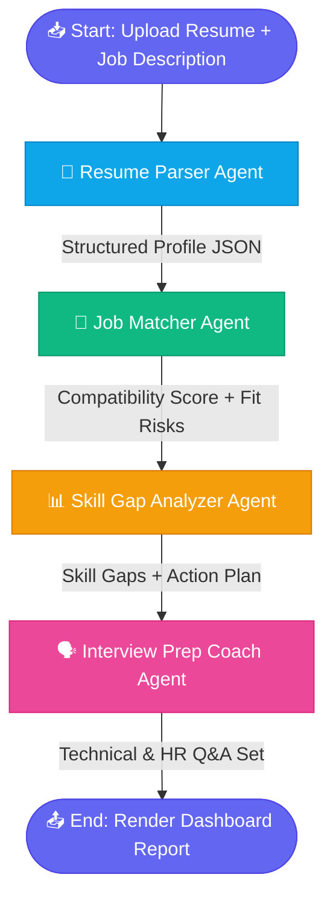

# 🤖 AI Resume Screening & Career Coaching Agent

A **multi-agent recruitment and coaching pipeline** that analyzes resumes, matches them against job descriptions, identifies skill gaps, and generates personalized interview preparation — all orchestrated with **LangGraph**, powered by **LangChain**, and served through a **Streamlit** dashboard.

---

## 📌 Overview

This project simulates an end-to-end AI recruiter workflow. Instead of a single LLM call, it uses a **graph of specialized agents**, each responsible for one stage of the hiring pipeline — from parsing a resume to coaching the candidate for their interview.

It supports multiple LLM backends (Gemini, OpenAI, local Ollama models) and includes a **Mock Demo Mode** for instant, zero-latency, offline testing without any API keys.

---

## ✨ Key Features

- **🔗 Multi-Agent Orchestration (LangGraph)**
  A stateful graph pipeline where each agent reads and writes to a shared state object, ensuring consistent data flow across stages.

- **📄 Resume Parser Agent**
  Extracts structured profile data (name, contact info, skills, experience, education, projects) from `PDF`, `DOCX`, and `TXT` resumes.

- **📊 Skill Gap Analyzer Agent**
  Compares the candidate's profile against target role requirements, maps competency gaps, and recommends a prioritized action plan to close them.

- **🎯 Job Matcher Agent**
  Evaluates a compatibility percentage between the resume and a given job description, and flags potential fit risks (e.g., missing certifications, experience mismatch).

- **🗣️ Interview Prep Coach Agent**
  Generates tailored **technical** and **HR round** Q&A simulations based on the candidate's profile and the target role.

- **⚙️ Flexible Inference Options**
  - Google **Gemini**
  - **OpenAI** (GPT models)
  - **Ollama** (local, offline LLMs)
  - **Mock Demo Mode** — zero-latency, offline, no API key required

- **🎨 Premium Dashboard UI**
  A polished Streamlit interface featuring glassmorphic panels, animated timeline nodes for pipeline progress, and clean data visualizations.

---

## 🧭 Pipeline Architecture

The pipeline runs as a **sequential LangGraph state machine**. Each node receives the shared state, performs its task, and updates the state before passing it to the next node.



**State Propagation Flow:**

1. **Resume Parser Agent** → extracts `profile` (skills, education, experience) into shared state.
2. **Job Matcher Agent** → reads `profile` + `job_description`, writes `match_score` and `fit_risks`.
3. **Skill Gap Analyzer Agent** → reads `profile` + `match_score`, writes `skill_gaps` and `action_plan`.
4. **Interview Prep Coach Agent** → reads all prior state, writes `technical_qa` and `hr_qa`.
5. **Dashboard** → renders the final aggregated state across all panels.

---

## 🛠️ Tech Stack

| Category | Tools / Libraries |
|---|---|
| Orchestration | `langgraph` |
| LLM Framework | `langchain`, `langchain-google-genai`, `langchain-openai`, `langchain-community` (Ollama) |
| UI / Dashboard | `streamlit` |
| Document Parsing | `pypdf` (PDF), `python-docx` (DOCX), native I/O (TXT) |
| Data Validation | `pydantic` |
| Environment Config | `python-dotenv` |
| Visualization | `mermaid` (architecture diagram) |

### `requirements.txt`
```
langgraph
langchain
langchain-google-genai
langchain-openai
langchain-community
streamlit
pypdf
python-docx
pydantic
python-dotenv
```

---

## 🚀 Setup & Execution

### 1. Clone the repository
```bash
git clone https://github.com/<your-username>/ai-resume-screening-agent.git
cd ai-resume-screening-agent
```

### 2. Create and activate a virtual environment
```bash
python -m venv venv

# Windows
venv\Scripts\activate

# macOS / Linux
source venv/bin/activate
```

### 3. Install dependencies
```bash
pip install -r requirements.txt
```

### 4. Run the app
```bash
streamlit run app.py
```

The dashboard will open automatically at:
```
http://localhost:8501
```

---

## 🔑 API & Offline Configuration

### Option A — Using `.env` file (Gemini / OpenAI)

Create a `.env` file in the project root:

```env
# Choose one or both providers
GOOGLE_API_KEY=your_gemini_api_key_here
OPENAI_API_KEY=your_openai_api_key_here

# Select active provider: gemini | openai | ollama | mock
LLM_PROVIDER=gemini
```

The app automatically loads this file via `python-dotenv` on startup.

### Option B — Local Inference with Ollama (Offline LLM)

1. [Install Ollama](https://ollama.com/download) for your OS.
2. Pull a model:
   ```bash
   ollama pull llama3
   ```
3. Ensure the Ollama server is running:
   ```bash
   ollama serve
   ```
4. Set in `.env`:
   ```env
   LLM_PROVIDER=ollama
   OLLAMA_MODEL=llama3
   ```

### Option C — Mock Demo Mode (No API Key, No Internet)

Ideal for quick demos, presentations, or offline testing — returns pre-built, realistic sample outputs instantly.

```env
LLM_PROVIDER=mock
```

Or toggle **"Demo Mode"** directly from the sidebar in the Streamlit UI.

---

## 📂 Project Structure

```
ai-resume-screening-agent/
├── app.py                  # Streamlit entry point & UI
├── graph/
│   ├── pipeline.py         # LangGraph state graph definition
│   ├── state.py            # Pydantic state schema
│   └── agents/
│       ├── resume_parser.py
│       ├── job_matcher.py
│       ├── skill_gap_analyzer.py
│       └── interview_coach.py
├── utils/
│   ├── file_loader.py      # PDF/DOCX/TXT extraction
│   └── llm_provider.py      # Gemini/OpenAI/Ollama/Mock switcher
├── .env.example
├── requirements.txt
└── README.md
```

---

## 📝 License

This project is open-source and available under the [MIT License](LICENSE).
